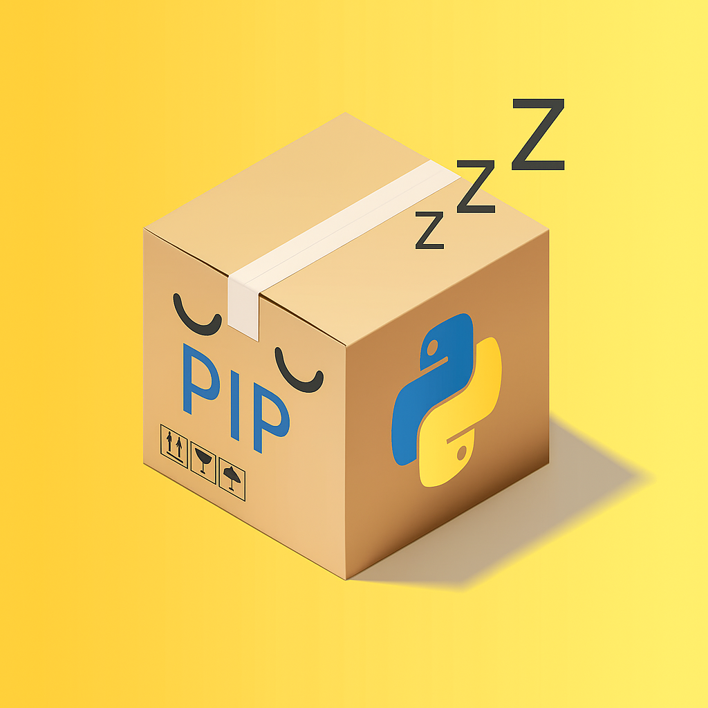

# Lazypip



## A lazygit-style TUI for Python package management using pip. Navigate, install, upgrade, and manage your Python packages with an intuitive terminal interface. 

>[!IMPORTANT]
>This project is currently **under active development** and not yet ready for use. Many features are incomplete or not yet implemented, once it is technically usable or stable, this README will be finished, and this information will be removed or changed.


### Features (Planned)

- [ ] Check if python, pip, or pipx is installed, if not, prompt to install.
- [ ] Interactive package management with vim-like keybindings and lazygit-style interface using gocui and tcell.
- [ ] Install/upgrade Python packages
- [ ] Manage requirements.txt
- [ ] View package information
- [ ] Search PyPI for packages

### Keybindings 

This project will use vim keybindings, if this changes then it will be documented here, until then this is what will be put in the README.

### Installation

#### Homebrew
```bash
brew install lazypip
```

#### PyPi
```bash
pip install lazypip
```

#### Source
```bash
git clone https://github.com/playfair/lazypip.git
cd lazypip
make
```

### Contributing

Contributions are welcome! Please feel free to submit a Pull Request. (Please, I beg.)
